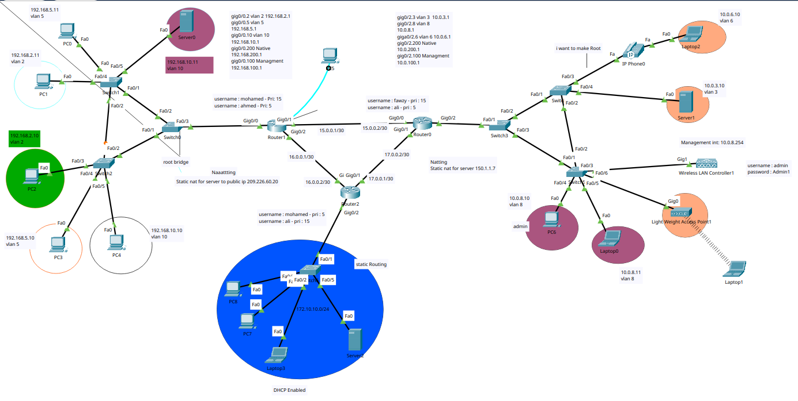

# Enterprise Network Lab

---

## 📖 Project Overview
This project simulates an **Enterprise Network**  with multiple core services and security features. It is designed to demonstrate skills in configuring and managing network infrastructure using Cisco technologies.

---

## 🔑 Key Features
- **Routing**: Static Routing, OSPF, RIP  
- **Switching & VLANs**: Router-on-a-Stick, STP configuration for redundancy  
- **Network Security**:
  - Access Control Lists (ACL)
  - Static NAT
  - Switch Port Security
  - DHCP Snooping
  - ARP Inspection
- **Wireless**: Integration of Access Point  
- **Network Services**:
  - DHCP Server  
  - TFTP Server  
  - Syslog Server  
  - NTP Server  
  - SNMP Server  

## 🖧 Topology

## 🖥️ Technologies Used
Cisco Packet Tracer

Cisco Routers & Switches (simulated)

Standard Networking Protocols (OSPF, RIP, NAT, SNMP, STP)
